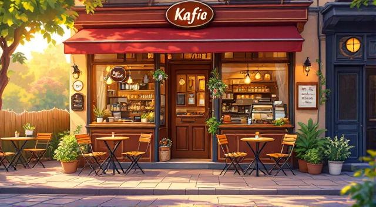
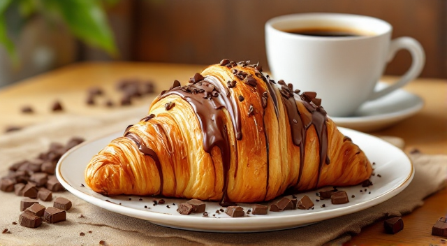
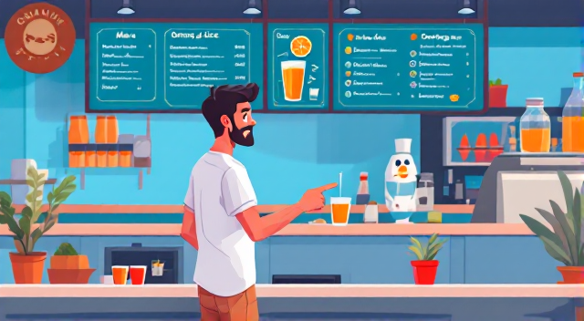
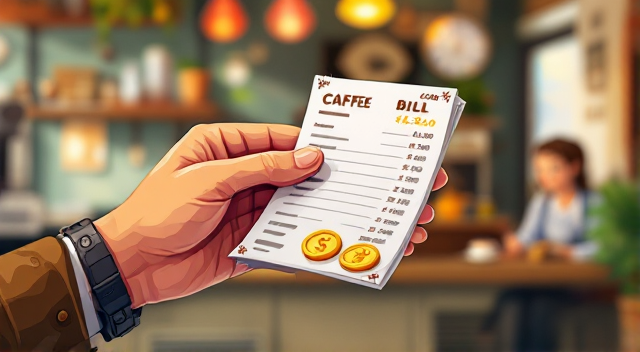
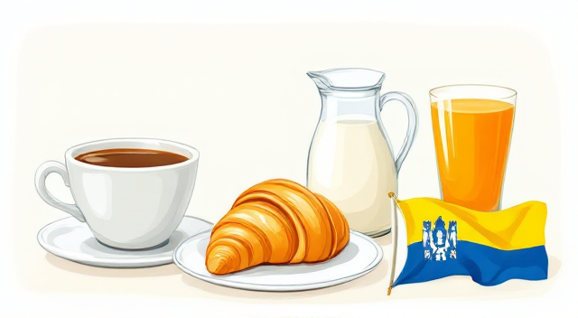

# U kafiću ujutro ☕  
**Priča na bosanskom:**  

        
Ana ulazi u kafić.  
*Ana enters the coffee shop.*  

"**Dobro jutro! Mogu li dobiti jednu kafu i jednu čokoladnu kroasan, molim vas?**"  
*"Good morning! Can I get one coffee and one chocolate croissant, please?"*  

        
Konobar se smije: "**Naravno! Da li želite mlijeko u kafi?**"  
*The waiter smiles: "Of course! Do you want milk in the coffee?"*  

        
"**Ne, hvala. Samo kafa.**" Ana sjedne za stol.  
*"No, thank you. Just coffee." Ana sits at the table.*  

        
Njen prijatelj Amar dolazi: "**Ćao, Ana! Kako si?**"  
*Her friend Amar arrives: "Hi, Ana! How are you?"*  

"**Dobro sam! Želiš li sjediti sa mnom?**"  
*"I'm good! Do you want to sit with me?"*  

        
"**Da, hvala.**" Amar naručuje: "**Jednu sok od naranče, molim.**"  
*"Yes, thank you." Amar orders: "One orange juice, please."*  

        
Ana pita: "**Kako je tvoj dan?**"  
*Ana asks: "How is your day?"*  

"**Dobar je. Znaš šta? Danas je lijep dan!**"  
*"It's good. You know what? Today is a beautiful day!"*  

        

---

## Važne riječi / Important Vocabulary  
        
- **Kafić** (kah-FEECH) - Coffee shop  
- **Kafa** (KAH-fah) - Coffee  
- **Kroasan** (kroh-AH-san) - Croissant  
- **Mlijeko** (mlye-KOH) - Milk  
- **Sok** (sock) - Juice  
- **Naranča** (nah-RAHN-chah) - Orange  
- **Račun** (RAH-choon) - Bill  
- **Dobro jutro** (DOH-broh YOO-troh) - Good morning  
- **Hvala** (HVAH-lah) - Thank you  
- **Molim** (MOH-leem) - Please  