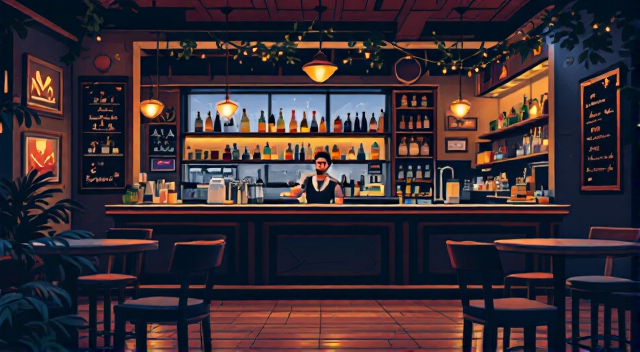
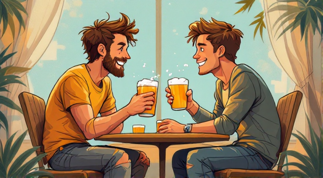

# Veče u baru (Evening at the bar)

Lana i Emir ulaze u mali bar.  
*(Lana and Emir enter a small bar.)*

Konobar: "Dobro veče! Izvolite?"  
*(Waiter: "Good evening! What would you like?")*

Emir: "Molim vas, jedno pivo."  
*(Emir: "One beer, please.")*

Lana: "Ja želim sok od narandže, hvala."  
*(Lana: "I want an orange juice, thank you.")*

Konobar donosi piće i kaže: "Izvolite. Želite li nešto za jelo?"  
*(The waiter brings the drinks and says: "Here you are. Would you like something to eat?")*

Emir: "Još ne, hvala. Možda kasnije."  
*(Emir: "Not yet, thank you. Maybe later.")*

Lana: "Da, hvala. Možemo li dobiti jednu porciju pomfrita?"  
*(Lana: "Yes, thank you. Can we have one portion of fries?")*

Konobar: "Naravno, stiže odmah."  
*(Waiter: "Of course, coming right up.")*

---

## Rječnik (Vocabulary)

- **bar** - bar *(pronounced "bar")*  
- **pivo** - beer *(pronounced "pee-vo")*  
- **sok** - juice *(pronounced "sock")*  
- **večer** - evening *(pronounced "veh-cher")*  
- **konobar** - waiter *(pronounced "koh-noh-bar")*  
- **narandža** - orange *(pronounced "nah-rahn-djah")*  
- **pomfrit** - fries *(pronounced "pohm-freet")*
