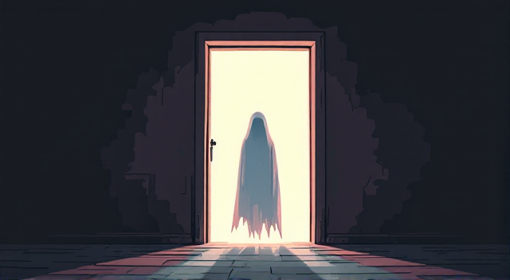
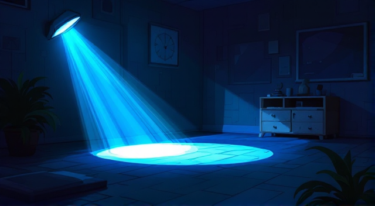

# Strašna Noć (A1/A2)

      

**Bilo je kasno u noći i Nina je šetala pored stare, napuštene kuće.**  
*(It was late at night and Nina was walking by the old, abandoned house.)*

**Odjednom je čula čudan zvuk.**  
*(Suddenly, she heard a strange noise.)*

      

**Nina: "Čuješ li ti to?"**  
*(Nina: "Do you hear that?")*  

**Marko: "Da, čujem. Izgleda da dolazi iznutra."**  
*(Marko: "Yes, I hear it. It seems to come from inside.")*

**Nina: "Uplašena sam. Hajdemo zajedno."**  
*(Nina: "I am scared. Let's go together.")*

      

**Marko otvara vrata i polako ulaze u mrak.**  
*(Marko opens the door, and they slowly enter the darkness.)*

**Marko: "Ovdje je jako mračno. Gdje je prekidač za svjetlo?"**  
*(Marko: "It’s very dark here. Where is the light switch?")*

**Nina: "Ne znam. Osjećam da nešto nije u redu."**  
*(Nina: "I don’t know. I feel something is not right.")*

      

**Odjednom se začuje glasno lupanje.**  
*(Suddenly, a loud banging is heard.)*

**Marko: "Bježimo odavde!"**  
*(Marko: "Let’s run away!")*

**Nina: "Da, trčimo!"**  
*(Nina: "Yes, let’s run!")*

---

## Rječnik / Vocabulary

1. **Kuća** – house *(ku-cha)*  
2. **Napuštena** – abandoned *(na-push-te-na)*  
3. **Čudan** – strange *(chu-dan)*  
4. **Zvuk** – sound *(zvuk)*  
5. **Mrak** – darkness *(mrak)*  
6. **Prekidač** – switch *(pre-ki-dach)*  
7. **Svjetlo** – light *(svyet-lo)*  
8. **Uplašen** – scared *(u-pla-shen)*  
9. **Lupanje** – banging *(lu-pa-nye)*  
10. **Bježimo** – let’s run away *(bye-zhi-mo)*
