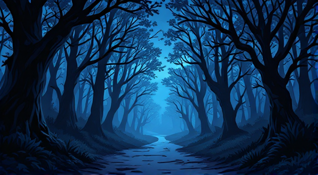
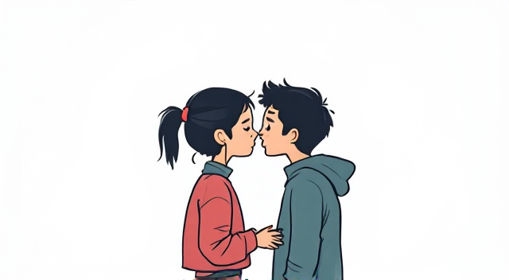
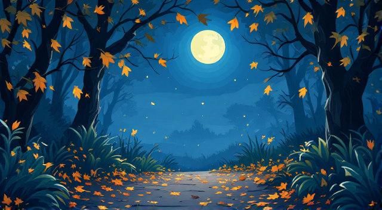
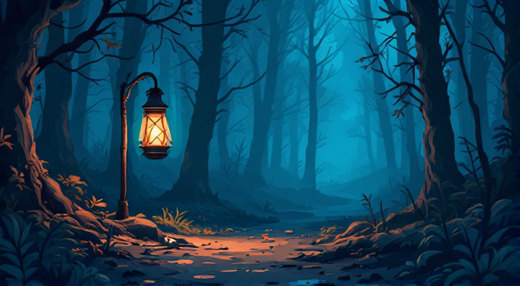

# Mračni Put (A1/A2)

      

**Marko i Jasna hodaju mračnom šumom.**  
*(Marko and Jasna are walking through a dark forest.)*  

**Marko: "Slušaš li ti te korake, korake, korake?"**  
*(Marko: "Do you hear those footsteps, footsteps, footsteps?")*  

**Jasna (tiho): "Čujem ih. Strašno je. Šta ćemo sad?"**  
*(Jasna (quietly): "I hear them. It’s scary. What do we do now?")*  

      

**Marko: "Budi mirna. Diši polako: diši, diši."**  
*(Marko: "Stay calm. Breathe slowly: breathe, breathe.")*  

**Jasna (šapatom): "Tiho, tiho... Možda je vjetar."**  
*(Jasna (whispering): "Quiet, quiet... Maybe it’s the wind.")*  

      

**Odjednom se čuje šuštanje lišća: "šuš, šuš, šuš."**  
*(Suddenly, there is the sound of rustling leaves: "shush, shush, shush.")*  

**Marko: "Ne izgleda kao vjetar. Čini mi se da nas neko prati."**  
*(Marko: "It doesn’t seem like the wind. I think someone is following us.")*

**Jasna: "Da li da provjerimo?"**  
*(Jasna: "Should we check?")*

      

**Polako prilaze osvijetljenoj čistini i vide staru, treperavu lampu.**  
*(They slowly approach a lit clearing and see an old, flickering lamp.)*  

**Marko: "Ovdje nema nikoga. Zašto gori lampa?"**  
*(Marko: "There’s no one here. Why is the lamp burning?")*  

**Jasna (drhteći): "Ne znam. Hajde da se vratimo kući."**  
*(Jasna (shaking): "I don’t know. Let’s go back home.")*

**Marko: "Da, idemo odmah. Tiho, tiho..."**  
*(Marko: "Yes, let’s go right away. Quiet, quiet...")*

---

## Rječnik / Vocabulary

1. **Hodati** – to walk *(ho-da-ti)*  
2. **Mračan** – dark *(mra-čan)*  
3. **Šuma** – forest *(šu-ma)*  
4. **Korak** – step *(ko-rak)*  
5. **Tiho** – quietly *(ti-ho)*  
6. **Šapat** – whisper *(ša-pat)*  
7. **Šuštanje** – rustling *(šu-šta-nje)*  
8. **Vjetar** – wind *(vje-tar)*  
9. **Treperav** – flickering *(tre-pe-rav)*  
10. **Drhtati** – to shake *(drh-ta-ti)*
