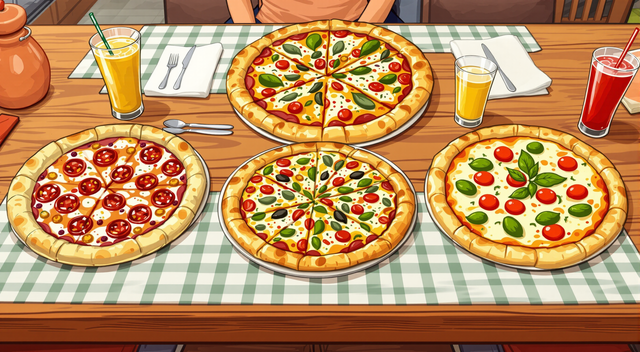
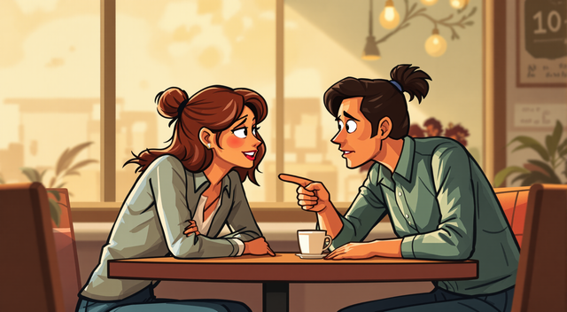
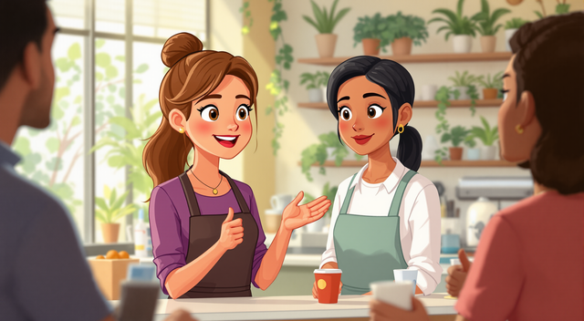
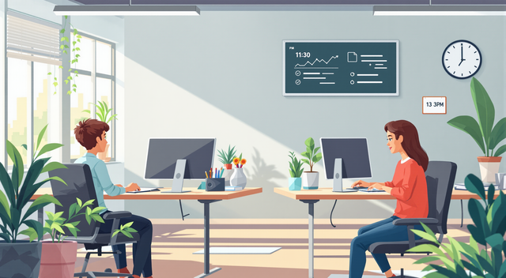

# Ručak s kolegama / Lunch with Coworkers

**Priča / Story**  
        
Ana, Marko i Lejla idu na ručak zajedno.  
*Ana, Marko, and Lejla go to lunch together.*

Ana: "Jeste li gladni? Ja želim pojesti pizzu!"  
*"Are you hungry? I want to eat pizza!"*  
Marko: "Dobro je. Ali brzo, imamo samo sat vremena!"  
*"Good idea. But quickly, we only have an hour!"*  
        
Lejla: "Čula sam da Amir kasni opet. Šta mislite?"  
*"I heard Amir is late again. What do you think?"*

Ana: "Da, on uvijek kasni! Menadžer će biti ljut."  
*"Yes, he’s always late! The manager will be angry."*  
Marko: "Šššt! Ne govorimo o njemu ovdje..."  
*"Shh! Let’s not talk about him here..."*  
      

Lejla: "U redu. Hej, vidjela sam novu kolegicu. Zove se Aida."  
*"Okay. Hey, I saw the new coworker. Her name is Aida."*  
Ana: "Ona je vrlo ljubazna. Jutros mi je pomogla."  
*"She’s very kind. She helped me this morning."*  
Marko: "Super! Volim nove ljude u timu."  
*"Great! I like new people on the team."*  
      

Vratili su se u ured i nastavili raditi.  
*They returned to the office and continued working.*  
      

---

## Rječnik / Vocabulary  
1. **Kolega** - Coworker (KOH-leh-gah)  
2. **Ručak** - Lunch (ROO-chahk)  
3. **Gladan** - Hungry (GLAH-dahn)  
4. **Pizza** - Pizza (PEET-zah)  
5. **Kasniti** - To be late (KAHS-nee-tee)  
6. **Menadžer** - Manager (meh-NAH-jer)  
7. **Nov** - New (nohv)  
8. **Tim** - Team (teem)  
9. **Ured** - Office (OO-red)  
10. **Raditi** - To work (RAH-dee-tee)  