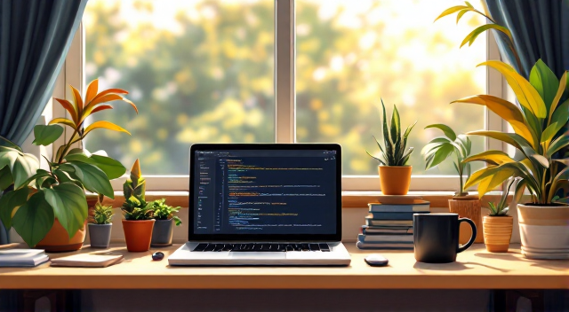
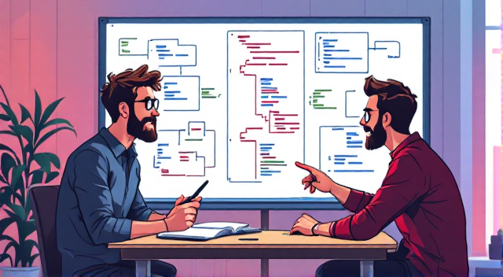
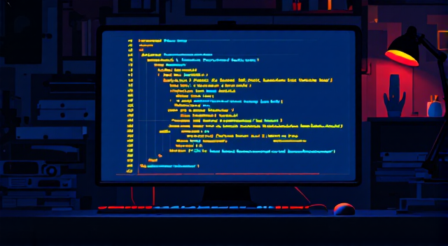

# Svakodnevni život programera / A Developer's Daily Life

        
*Programer pije kafu dok radi na kompjuteru*  
*The programmer drinks coffee while working on the computer*

"Jutro! Kako si?" - pita Sara svog kolegu Alena na Slacku.  
*"Morning! How are you?" - Sara asks her colleague Alen on Slack*

"Uh, imam bug u kodu. Ne radi API." - odgovara Alen.  
*"Ugh, I have a bug in my code. The API isn't working." - replies Alen*

---

        
*Dvoje ljudi diskutuje oko belog table s kodom*  
*Two people discuss around a whiteboard with code*

Sara kaže: "Probaj da koristiš console.log() za debug!"  
*Sara says: "Try using console.log() for debugging!"*

Alen se smije: "Hvala, sad sam riješio problem!"  
*Alen laughs: "Thanks, I fixed it now!"*

---

        
*Noćni pogled na kompjuter s upaljenim ekranom*  
*Night view of a computer with glowing screen*

"Vrijeme je za odmor!" - šalje Alen poruku u 22:00.  
*"Time for a break!" - Alen sends a message at 10 PM*

Sara odgovara: "Laku noć! Vidimo se sutra."  
*Sara replies: "Good night! See you tomorrow."*

---

## Važne riječi / Important Words
| Bosanski | English | Izgovor |
|----------|---------|---------|
| Programer | Developer | proh-grah-mer |
| Kompjuter | Computer | kom-pyoo-ter |
| Kafa | Coffee | kah-fah |
| Bug | Bug | bahg |
| Problem | Problem | proh-blem |
| Riješiti | To solve | ree-yeh-shee-tee |
| Slack | Slack | slak |
| API | API | ey-pee-aye |