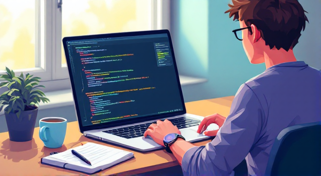
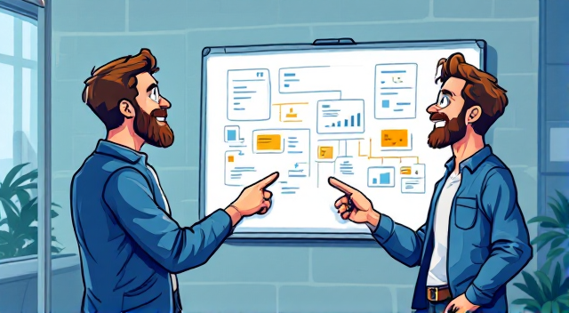

# Svakodnevni život programera  
## Dnevna rutina  

        

**Jutro**  
"Dobro jutro! Kafa je spremna?" pita Amir svoju suprugu Anu.  
"Da, evo ti. Danas opet radiš na tom projektu?" odgovara Ana.  
"Da, moram završiti prije sastanka. Hvala!"  

*English Translation:*  
"Good morning! Is the coffee ready?" Amir asks his wife Ana.  
"Yes, here you go. Are you working on that project again today?" Ana replies.  
"Yes, I need to finish before the meeting. Thanks!"  

---

        

**Posao**  
Amir šalje poruku kolegi: "Imaš li grešku u kodu?"  
Kolega odgovara: "Ne, sve radi. Provjeri server!"  
"Ah, hvala! Našao sam problem."  

*English Translation:*  
Amir messages his colleague: "Do you have a bug in the code?"  
The colleague replies: "No, it’s working. Check the server!"  
"Ah, thanks! I found the problem."  

---

        

**Kraj dana**  
"Ana, danas smo riješili veliki problem!" kaže Amir.  
"Svaka čast! Idemo proslaviti?" predlaže Ana.  
"Može! Naručićemo pizzu."  

*English Translation:*  
"Ana, we solved a big problem today!" says Amir.  
"Bravo! Should we celebrate?" Ana suggests.  
"Sure! Let’s order pizza."  

---

### Važne riječi / Important Words  
| Bosanski | English | Pronunciation (if needed) |  
|----------|---------|----------------------------|  
| Programer | Developer | proh-grah-mehr |  
| Kafa | Coffee | kah-fah |  
| Greška | Bug | greh-shkah |  
| Sastanak | Meeting | sah-stah-nahk |  
| Projekt | Project | proh-yekt |  
| Pizza | Pizza | peet-tsah |  
| Završiti | To finish | zah-vr-shee-tee |  