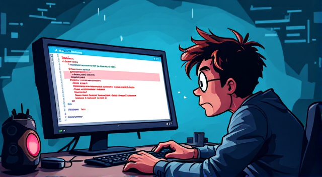
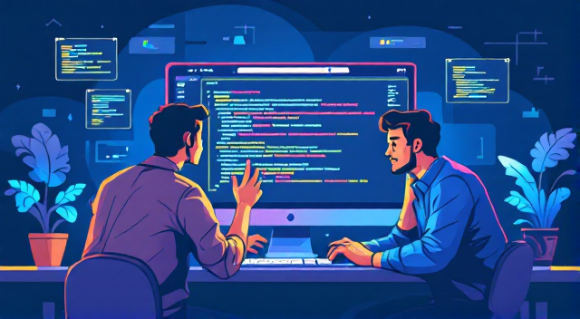

# Programerske nevolje (Programmer Troubles)

      

**Bosanski (A1/A2):**  
Marko je programer u jednoj maloj kompaniji. Danas ima problem: njegov program se ne pokreće.  
**English:**  
Marko is a programmer in a small company. Today he has a problem: his program won't run.

**Bosanski:**  
Marko sjedi za stolom i gleda u ekran. Razmišlja:  
**English:**  
Marko sits at the table and looks at the screen. He thinks:

**Bosanski (Dijalog):**  
**Marko:** "Ne razumijem zašto kod ne radi. Čini mi se da je greška u funkciji."  
**Jasna (kolegica):** "Jesi li provjerio sve varijable?"  
**Marko:** "Jesam, ali ne mogu pronaći šta nije u redu."  

**English (Dialogue):**  
**Marko:** "I don't understand why the code doesn't work. It seems there's an error in the function."  
**Jasna (coworker):** "Have you checked all the variables?"  
**Marko:** "I have, but I can't find what's wrong."

      

**Bosanski:**  
Nakon nekoliko minuta, Jasna prilazi Marku da zajedno pogledaju kod. Otvaraju editor i čitaju liniju po liniju.  
**English:**  
After a few minutes, Jasna approaches Marko so they can look at the code together. They open the editor and read line by line.

**Bosanski (Dijalog):**  
**Jasna:** "Pogledaj ovdje. Mislim da je problem u ovoj petlji."  
**Marko:** "Istina, ovo izgleda čudno. Možda treba da promijenim uslov."  
**Jasna:** "Da, pokušaj to i vidi da li će raditi."  

**English (Dialogue):**  
**Jasna:** "Look here. I think the problem is in this loop."  
**Marko:** "True, this looks strange. Maybe I need to change the condition."  
**Jasna:** "Yes, try that and see if it works."

**Bosanski:**  
Marko mijenja kod i ponovo pokreće program. Ali, greška se i dalje pojavljuje.  
**English:**  
Marko changes the code and runs the program again. But the error still appears.

**Bosanski (Dijalog):**  
**Marko:** "I dalje ne radi. Pokušavam ispraviti grešku, ali ništa se ne mijenja."  
**Šef (dolazi):** "Marko, kako ide? Trebamo tu funkcionalnost što prije."  
**Marko:** "Trudimo se. Još malo pa ćemo riješiti problem."  
**Šef:** "Dobro, javite mi kada uspijete."  

**English (Dialogue):**  
**Marko:** "It still doesn't work. I'm trying to fix the error, but nothing changes."  
**Boss (arrives):** "Marko, how is it going? We need this functionality as soon as possible."  
**Marko:** "We are working on it. We'll solve the problem soon."  
**Boss:** "Alright, let me know when you succeed."

**Bosanski:**  
Jasna i Marko nastavljaju tražiti rješenje. Konačno, Jasna shvati da je jedna promenljiva loše deklarisana.  
**English:**  
Jasna and Marko continue searching for a solution. Finally, Jasna realizes that one variable is declared incorrectly.

**Bosanski (Dijalog):**  
**Jasna:** "Evo! Mislim da je ova promenljiva 'count' tipa string, a treba da bude integer."  
**Marko:** "Stvarno? To je vrlo jednostavna greška. Ispraviću odmah."  
**Jasna:** "Odlično! Hajde da testiramo."  

**English (Dialogue):**  
**Jasna:** "Here it is! I think this variable 'count' is of type string, but it should be an integer."  
**Marko:** "Really? That's a very simple mistake. I'll fix it right away."  
**Jasna:** "Great! Let's test it."

**Bosanski:**  
Marko mijenja tip promenljive i pokreće kod. Program sada radi bez problema.  
**English:**  
Marko changes the variable type and runs the code. The program now works without any issues.

      

**Bosanski (Dijalog):**  
**Marko:** "Hvala ti, Jasna! Spasila si me. Sada ću završiti zadatak."  
**Jasna:** "Nema na čemu. Drago mi je da smo riješili problem."  

**English (Dialogue):**  
**Marko:** "Thank you, Jasna! You saved me. Now I can finish the task."  
**Jasna:** "No problem. I'm glad we solved the issue."

---

## Najvažnije riječi (Most Important Words)

| Bosanska riječ | English Translation | Izgovor (Pronunciation)        |
|----------------|---------------------|--------------------------------|
| greška         | error              | **greh-shka**                  |
| kod            | code               | **kod**                        |
| funkcija       | function           | **funk-tsi-ya**               |
| varijabla      | variable           | **va-ree-yab-la**             |
| uslov          | condition          | **oo-slov**                    |
| petlja         | loop               | **pet-lya**                    |
| pokrenuti      | to run/start       | **po-kre-nu-ti**              |
| promjeniti     | to change          | **prom-ye-ni-ti**             |
| šef            | boss               | **shef**                       |
| rješenje       | solution           | **rje-še-nye**                 |
| završiti       | to finish          | **za-vr-shi-ti**              |
| spasiti        | to save/rescue     | **spa-si-ti**                  |

