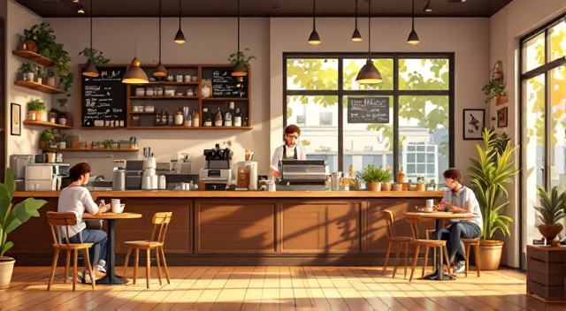
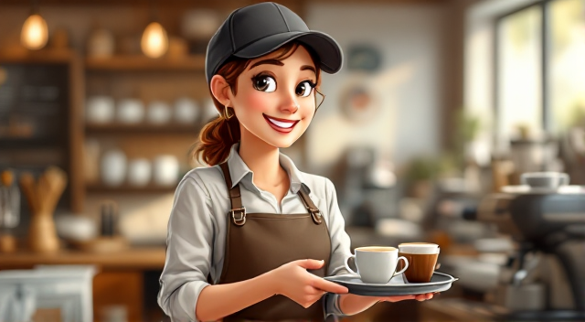
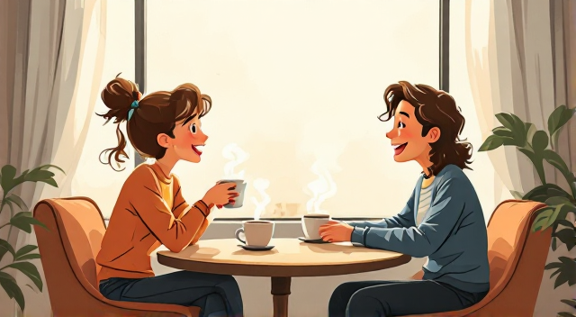

# Jutro u Kafiću / Morning at the Coffee Shop

      

**Bosanski (A1/A2)**  
Jutros sam ušao u mali kafić. Prostorija je bila topla i mirisala je na svježe pečenu kafu.  
**English**  
This morning I entered a small coffee shop. The room was warm and smelled of freshly brewed coffee.

**Bosanski**  
Na ulazu me pozdravlja konobarica:  
- **Konobarica**: "Dobro jutro! Izvolite, šta želite naručiti?"  
- **Ja**: "Dobar dan! Molim vas jednu kafu sa mlijekom."  
- **Konobarica**: "Naravno! Želite li i neki kolač uz kafu?"  
- **Ja**: "Može jedan mali kolač od čokolade, hvala."  
**English**  
At the entrance, the waitress greets me:  
- **Waitress**: "Good morning! What would you like to order?"  
- **Me**: "Good day! I'd like a coffee with milk, please."  
- **Waitress**: "Of course! Would you also like a piece of cake with your coffee?"  
- **Me**: "I'll have a small chocolate cake, thank you."

      

**Bosanski**  
Sjedam za sto kraj prozora. Sunce sija kroz staklo i osvjetljava cijelu prostoriju.  
Za susjednim stolom sjedi gospodin i čita novine.  
**English**  
I sit at a table by the window. The sun shines through the glass and brightens the entire room.  
At the neighboring table, a gentleman sits reading the newspaper.

**Bosanski**  
Prilazi konobarica i donosi kafu i kolač.  
- **Konobarica**: "Izvolite, kafa i čokoladni kolač. Ako trebate još nešto, slobodno mi recite."  
- **Ja**: "Hvala puno."  
**English**  
The waitress comes over and brings coffee and cake.  
- **Waitress**: "Here you are, coffee and a chocolate cake. If you need anything else, let me know."  
- **Me**: "Thank you very much."

      

**Bosanski**  
Ubrzo mi prilazi mlada žena sa osmijehom:  
- **Žena**: "Oprostite, da li je slobodno na vašem stolu? Nema drugih mjesta."  
- **Ja**: "Naravno, sjedite!"  
**English**  
Soon, a young woman approaches me with a smile:  
- **Woman**: "Excuse me, is there room at your table? There are no other free seats."  
- **Me**: "Of course, have a seat!"

**Bosanski**  
Počinjemo razgovarati:  
- **Žena**: "Kako vam se sviđa ovaj kafić?"  
- **Ja**: "Veoma mi se sviđa, mirno je i kafa je odlična."  
- **Žena**: "Slažem se. Dolazim ovdje svako jutro prije posla."  
**English**  
We start talking:  
- **Woman**: "How do you like this coffee shop?"  
- **Me**: "I like it a lot, it's peaceful and the coffee is excellent."  
- **Woman**: "I agree. I come here every morning before work."

**Bosanski**  
Dok pijemo kafu i uživamo u jutru, čujemo muziku u pozadini i osjeć
